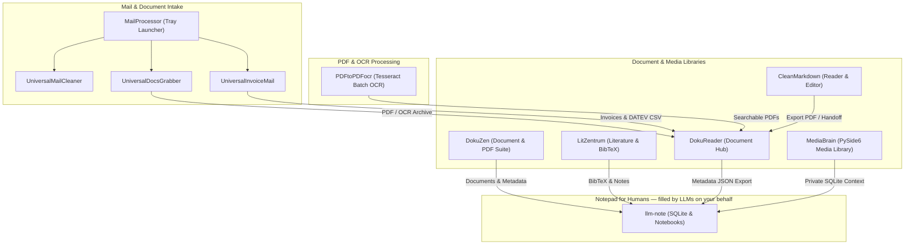

# doc-bricks

  

  <strong>Local-First Desktop Tools for Document Libraries, Reading, Mail Intake, OCR, Literature Management, and LLM-Agent Notes</strong>

  
  
  
  
  
  
  
  
  

> [!NOTE]
> **Local-First & LLM-Ready:** All doc-bricks tools run locally on your system, keeping documents, PDFs, and notes private. Machine-readable context is available in [`llms.txt`](https://github.com/doc-bricks/.github/blob/main/llms.txt) for LLM agents and crawlers.
> Public index verified against live GitHub API: **2026-09-11**.

> [!TIP]
> **Deutsche Version:** Eine deutschsprachige Übersetzung dieser Organisations-Startseite finden Sie unter [`profile/README_de.md`](https://github.com/doc-bricks/.github/blob/main/profile/README_de.md).

---

## Ecosystem Architecture

---

## Start Here

| Goal | Recommended Tool | Core Capability |
|---|---|---|
| Manage local document libraries, topics, and PDF bundles | [DokuReader](https://github.com/doc-bricks/DokuReader) | Local-first document library, preview workflow, reading state, PDF bundling, and metadata JSON export |
| Use one workspace for document, PDF, OCR, and file utilities | [DokuZen](https://github.com/doc-bricks/DokuZen) | Cross-platform PySide6 suite combining 22 specialized local-first utilities |
| Read and edit Markdown without cloud lock-in | [CleanMarkdown](https://github.com/doc-bricks/CleanMarkdown) | Local Markdown viewer/editor with clean reading mode, PDF export, session handoff, and PWA companion |
| Organize local media and document context | [MediaBrain](https://github.com/doc-bricks/MediaBrain) | PySide6 media library manager with smart playlists, provider detection, tags, blacklist, and private SQLite storage |
| Manage literature, PDFs, BibTeX, and research notes | [LitZentrum](https://github.com/doc-bricks/LitZentrum) | Literature manager for academic reading, bibliography workflows, and PDF-centered research |
| Launch the mail-tool family from one tray app | [MailProcessor](https://github.com/doc-bricks/MailProcessor) | System tray entry point for Universal Mail Cleaner, UniversalDocsGrabber, and UniversalInvoiceMail |
| Download and archive mail attachments locally | [UniversalDocsGrabber](https://github.com/doc-bricks/UniversalDocsGrabber) | IMAP/Gmail attachment downloader with OCR, PDF conversion, dedupe, and review workflows |
| Clean large IMAP or Gmail mailboxes safely | [UniversalMailCleaner](https://github.com/doc-bricks/UniversalMailCleaner) | Mailbox cleaner with safe trash mode, labels, scheduler, and large-item cleanup |
| Collect invoices and receipts from mail | [UniversalInvoiceMail](https://github.com/doc-bricks/UniversalInvoiceMail) | Invoice extractor with Gmail/IMAP input, OCR, PDF conversion, JSON export, and DATEV-oriented workflows |
| Convert scans into searchable PDFs in batches | [PDFtoPDFocr](https://github.com/doc-bricks/PDFtoPDFocr) | Local PySide6/Tesseract OCR with language selection, portable engines, and source-file preservation |
| Keep local notes for LLM agents | [llm-note](https://github.com/doc-bricks/llm-note) | Local-first SQLite notes, plain-text notebooks, six locales, and a standalone agent skill extracted from BACH |

---

## Capability & Format Matrix

| Repository | Formats & Sources | Core Capabilities | Primary Use Case | Output & Exports |
|---|---|---|---|---|
| [CleanMarkdown](https://github.com/doc-bricks/CleanMarkdown) | Markdown, Plaintext, HTML | Distraction-free reading, split-view editing, live preview | Focused Markdown editing and session handoffs | Formatted PDF, HTML, PWA session JSON |
| [DokuReader](https://github.com/doc-bricks/DokuReader) | PDF, EPUB, TXT, MD | Multi-tab reader, topic trees, bookmarking, reading progress | Local-first document library & topic organization | PDF bundles, metadata-only JSON export |
| [DokuZen](https://github.com/doc-bricks/DokuZen) | PDF, DOCX, MD, TXT, images | Document library, PDF workshop, OCR, redaction, conversion | Unified local document processing workspace | Searchable PDFs, converted documents, extracted text |
| [LitZentrum](https://github.com/doc-bricks/LitZentrum) | PDF, BibTeX, DOI references | Academic paper catalog, citation management, literature notes | Scientific paper analysis & bibliography maintenance | BibTeX `.bib`, structured JSON index |
| [llm-note](https://github.com/doc-bricks/llm-note) | SQLite, Plaintext Markdown | Agent scratchpad, prompt logs, structured notes inbox | Memory persistence and notebook inbox for LLMs | SQLite DB, Markdown notebooks, CLI/Python API |
| [MailProcessor](https://github.com/doc-bricks/MailProcessor) | IMAP, Gmail, EML | System tray launcher, process daemon, quick status | Unified tray orchestration for all mail utilities | Process supervisor, desktop notifications |
| [MediaBrain](https://github.com/doc-bricks/MediaBrain) | Audio, Video, Images, Documents | Smart playlists, provider detection, tagging, blacklist | Local media & document asset management | Private SQLite DB, structured playlist exports |
| [PDFtoPDFocr](https://github.com/doc-bricks/PDFtoPDFocr) | Scanned PDFs, JPG, PNG, TIFF | Batch Tesseract OCR, language selection, auto-merge | Non-destructive conversion of scans to searchable PDFs | Searchable PDFs, portable job manifest JSON |
| [UniversalDocsGrabber](https://github.com/doc-bricks/UniversalDocsGrabber) | IMAP/Gmail Attachments, PDFs, Images | Automated batch fetch, deduplication, OCR processing | Document mail attachment harvesting & archiving | Searchable PDFs, OCR text, PWA review |
| [UniversalInvoiceMail](https://github.com/doc-bricks/UniversalInvoiceMail) | IMAP/Gmail Invoices & Receipts | Header parsing, OCR, amount detection, duplicate filter | Invoice collection & accounting preparation | Searchable PDFs, DATEV-style CSV, JSON |
| [UniversalMailCleaner](https://github.com/doc-bricks/UniversalMailCleaner) | IMAP, Gmail Mailboxes | Size filtering, rule-based cleanup, safe trash mode | Mailbox maintenance and storage reclamation | Clean mailbox, cleanup audit reports |

---

## Repository Showcase

Our local-first document toolset — the banners are the links; details in the table below:

  
  
  
  
  
  
  
  
  
  
  

More repositories without their own artwork yet: **[.github](https://github.com/doc-bricks/.github)** (organization profile and shared community-health files)

---

## Public Repository Directory

This index covers every public doc-bricks repository visible on GitHub as of **2026-09-11**. Private or internal repositories are intentionally not listed on the public organization profile.

| Repository | Role | Discovery notes |
|---|---|---|
| [.github](https://github.com/doc-bricks/.github) | Organization profile and shared community-health files | Start page, issue templates, pull request template, security policy, and `llms.txt` |
| [CleanMarkdown](https://github.com/doc-bricks/CleanMarkdown) | Markdown reading and editing | Markdown viewer/editor, reading mode, PDF export, session handoff, PWA companion |
| [DokuReader](https://github.com/doc-bricks/DokuReader) | Document library | Local-first document manager, reading state, topic organization, preview workflow, PDF bundling, metadata-only JSON export |
| [DokuZen](https://github.com/doc-bricks/DokuZen) | Document and PDF suite | Cross-platform PySide6 workspace with 22 text, PDF, OCR, redaction, conversion, and file utilities |
| [LitZentrum](https://github.com/doc-bricks/LitZentrum) | Literature management | PDF library, BibTeX workflows, academic reading, research notes, JSON export |
| [llm-note](https://github.com/doc-bricks/llm-note) | Agent notes and notebooks | Local-first SQLite note log, plain-text notebooks, six locales, CLI/Python API, and standalone agent skill |
| [MailProcessor](https://github.com/doc-bricks/MailProcessor) | Mail tool launcher | System tray entry point for Universal Mail Cleaner, UniversalDocsGrabber, and UniversalInvoiceMail |
| [MediaBrain](https://github.com/doc-bricks/MediaBrain) | Media and document hub | PySide6 media library manager, smart playlists, provider detection, tags, blacklist, private SQLite storage |
| [PDFtoPDFocr](https://github.com/doc-bricks/PDFtoPDFocr) | PDF OCR conversion | Local PySide6/Tesseract batch conversion to searchable PDFs with portable engines and preserved originals |
| [UniversalDocsGrabber](https://github.com/doc-bricks/UniversalDocsGrabber) | Mail attachment intake | IMAP/Gmail document downloader, OCR, PDF conversion, dedupe, PWA review |
| [UniversalInvoiceMail](https://github.com/doc-bricks/UniversalInvoiceMail) | Invoice and receipt intake | Invoice and receipt email archiver, OCR, PDF conversion, JSON export, DATEV-style CSV export |
| [UniversalMailCleaner](https://github.com/doc-bricks/UniversalMailCleaner) | Mailbox cleanup | Gmail and IMAP cleaner, safe trash mode, labels, scheduler, large-item cleanup |

---

## Current Public Activity Snapshot

Live activity verified via GitHub API on **2026-09-11**. Dates are the UTC day of the API's `pushed_at` field, not a local-time conversion:

| Repository | Last Public Push | Focus & Navigation Purpose |
|---|---:|---|
| **[DokuReader](https://github.com/doc-bricks/DokuReader)** | **2026-09-11** | Local-first document library, topic trees, reading status, PDF bundling & metadata JSON export |
| **[PDFtoPDFocr](https://github.com/doc-bricks/PDFtoPDFocr)** | **2026-09-11** | Batch Tesseract OCR engine converting scans and images to searchable PDFs |
| **[CleanMarkdown](https://github.com/doc-bricks/CleanMarkdown)** | **2026-09-11** | Focused Markdown viewer/editor with reading mode, PDF export, session handoff, and PWA companion |
| **[UniversalInvoiceMail](https://github.com/doc-bricks/UniversalInvoiceMail)** | **2026-09-11** | Invoice & receipt mail harvester with IMAP/Gmail API, OCR, PDF conversion, and DATEV-style CSV export |
| **[MailProcessor](https://github.com/doc-bricks/MailProcessor)** | **2026-09-11** | System tray launcher and orchestrator for the Universal Mail Tools family |
| **[.github](https://github.com/doc-bricks/.github)** | **2026-09-11** | Organization profile, community health files, issue templates, and machine-readable `llms.txt` |
| **[UniversalDocsGrabber](https://github.com/doc-bricks/UniversalDocsGrabber)** | **2026-09-10** | Automated attachment downloader and document archive builder with OCR and PWA review |
| **[DokuZen](https://github.com/doc-bricks/DokuZen)** | **2026-09-10** | Unified local-first PySide6 workspace with 22 text, PDF, OCR, redaction, and conversion tools |
| **[LitZentrum](https://github.com/doc-bricks/LitZentrum)** | **2026-08-24** | Academic literature manager for PDFs, BibTeX collections, citation workflows, and JSON exports |
| **[MediaBrain](https://github.com/doc-bricks/MediaBrain)** | **2026-08-21** | Media library manager with smart playlists, provider detection, tags, and private SQLite storage |
| **[UniversalMailCleaner](https://github.com/doc-bricks/UniversalMailCleaner)** | **2026-08-16** | Local mailbox cleaner with safe trash mode, labels, scheduler, and large-attachment hygiene |
| **[llm-note](https://github.com/doc-bricks/llm-note)** | **2026-08-03** | Local-first SQLite notes and notebook inboxes for LLM agents extracted from BACH |

---

## Project Families

### Document Reading And Libraries

| App | Description |
|---|---|
| [DokuReader](https://github.com/doc-bricks/DokuReader) | Local-first document library with topic organization, previews, read status, PDF bundling, and metadata export |
| [DokuZen](https://github.com/doc-bricks/DokuZen) | Cross-platform local-first document management and processing suite with 22 text, PDF, OCR, and file utilities |
| [CleanMarkdown](https://github.com/doc-bricks/CleanMarkdown) | Markdown viewer/editor for clean reading, editing, PDF export, and session handoff |
| [LitZentrum](https://github.com/doc-bricks/LitZentrum) | Literature management suite with PDF, BibTeX, JSON export, and research-oriented organization |
| [MediaBrain](https://github.com/doc-bricks/MediaBrain) | Local-first PySide6 media library manager with smart playlists, provider detection, tags, blacklist, and private SQLite storage |

### Mail And Intake Workflows

| App | Description |
|---|---|
| [MailProcessor](https://github.com/doc-bricks/MailProcessor) | System tray launcher for Universal Mail Cleaner, UniversalDocsGrabber, and UniversalInvoiceMail |
| [UniversalMailCleaner](https://github.com/doc-bricks/UniversalMailCleaner) | Local Gmail and IMAP mailbox cleanup with safe modes and scheduler support |
| [UniversalDocsGrabber](https://github.com/doc-bricks/UniversalDocsGrabber) | Attachment downloader and document archive builder for IMAP/Gmail intake, OCR, PDF conversion, and PWA review |
| [UniversalInvoiceMail](https://github.com/doc-bricks/UniversalInvoiceMail) | Invoice and receipt collection pipeline for local archives, OCR/PDF conversion, JSON export, and DATEV-style CSV export |

### PDF, OCR, And Export

| App | Description |
|---|---|
| [UniversalDocsGrabber](https://github.com/doc-bricks/UniversalDocsGrabber) | Converts downloaded mail documents into reviewable PDF/OCR archive material |
| [UniversalInvoiceMail](https://github.com/doc-bricks/UniversalInvoiceMail) | Converts invoice and receipt mail into PDF/OCR archive material and accounting-oriented exports |
| [CleanMarkdown](https://github.com/doc-bricks/CleanMarkdown) | Exports Markdown reading sessions to PDF and companion web formats |
| [DokuZen](https://github.com/doc-bricks/DokuZen) | Combines PDF editing, OCR, redaction, conversion, and document-library workflows in one workspace |
| [PDFtoPDFocr](https://github.com/doc-bricks/PDFtoPDFocr) | Batch-converts scanned PDFs and images to searchable PDFs with local Tesseract OCR |

### Notes And Agent Handoffs

| App | Description |
|---|---|
| [llm-note](https://github.com/doc-bricks/llm-note) | Local-first notes and notebook inboxes for LLM agents, extracted from BACH Notizblock/Denkarium patterns |

---

## Design Principles

- **Local first:** documents, mail exports, indexes, and reading state stay on the user's machine by default.
- **Privacy-conscious:** tools avoid cloud processing unless an external service such as Gmail is explicitly configured by the user.
- **Document-practical:** each project targets repeated real workflows: reading, previewing, cleaning, exporting, archiving, and handoff.
- **Structured exports:** JSON, BibTeX, PDF, and companion formats are documented so data can move between desktop tools and later automation.
- **Readable maintenance:** READMEs, tests, and `llms.txt` files are kept useful for both human maintainers and LLM-based assistants.

---

## Discovery Signals

Useful search phrases for the public doc-bricks profile include `local-first document tools`, `Python document management`, `PySide6 PDF OCR`, `DokuReader metadata JSON export`, `DokuZen document PDF utilities`, `PDFtoPDFocr Tesseract searchable PDF`, `MediaBrain smart playlists private SQLite`, `Gmail IMAP attachment downloader`, `Markdown PDF export`, `literature manager GitHub`, `invoice mail OCR DATEV export`, and `local-first LLM agent notes`.

---

## Machine-Readable Context

For crawlers and LLM tools, see [`llms.txt`](https://github.com/doc-bricks/.github/blob/main/llms.txt). It lists the canonical repositories, project roles, and preferred search phrases for the doc-bricks organization.

---

## Ecosystem

doc-bricks is the document-work branch of the brick suite:

| Organization | Primary Domain | Focus & Specialization |
|---|---|---|
| **[open-bricks](https://github.com/open-bricks)** | Umbrella / Dach | Parent organization connecting all software products, tools, and research frameworks |
| **[ellmos-ai](https://github.com/ellmos-ai)** | LLM-OS / AI Infra | Agent operating systems (BACH, Rinnsal), memory pillar (.MEMORY, USMC, gardener), MCP servers |
| **[file-bricks](https://github.com/file-bricks)** | Desktop Utilities | Local-first PySide6 desktop file management, duplicate detection, and storage apps |
| **[doc-bricks](https://github.com/doc-bricks)** | Document Tools | Markdown tools, PDF processing, OCR engines, and document workflow software |
| **[dev-bricks](https://github.com/dev-bricks)** | Developer Tools | Developer utilities and IDEs (DevCenter, CodeBox, pythonbox, MethodenAnalyser, CareCenter) |
| **[research-line](https://github.com/research-line)** | Open Science | Open-access research in mathematical physics, cosmology, number theory, and AI society |
| **[biotec-line](https://github.com/biotec-line)** | Bioinformatics | Genomic variant tools, VCF processing, and clinical genetics software |
| **[entertain-and-more](https://github.com/entertain-and-more)** | Entertainment | Games with AI integration, interactive chess (ChatAndChess), and audio tools (Klangpult) |
| **[assistassets-ai](https://github.com/assistassets-ai)** | Financial AI | Local-first financial analysis, indicators, and assistant tools (FinancialProof) |
| **[um-bruch](https://github.com/um-bruch)** | Applied Health | Public health policy studies, prescribing risk analysis, and systems medicine |
| **[lukisch](https://github.com/lukisch)** | Personal / Core | Personal profile, core developer repositories, and cross-discipline integration |

Part of the [ellmos-ai](https://github.com/ellmos-ai) ecosystem: [llm-note](https://github.com/doc-bricks/llm-note) was extracted from [ellmos-ai/bach](https://github.com/ellmos-ai/bach)'s Notizblock/Denkarium patterns and remains usable as a standalone agent-notes skill.

---

## Related (other orgs)

| Project | Description |
|---|---|
| [WikiStub-Seed](https://github.com/dev-bricks/WikiStub-Seed) | Multilingual knowledge-stub dataset (630 terms, 12 domains, DE/EN + es/ja/ru/zh) with a web publisher — deployable as a self-contained wiki module |
