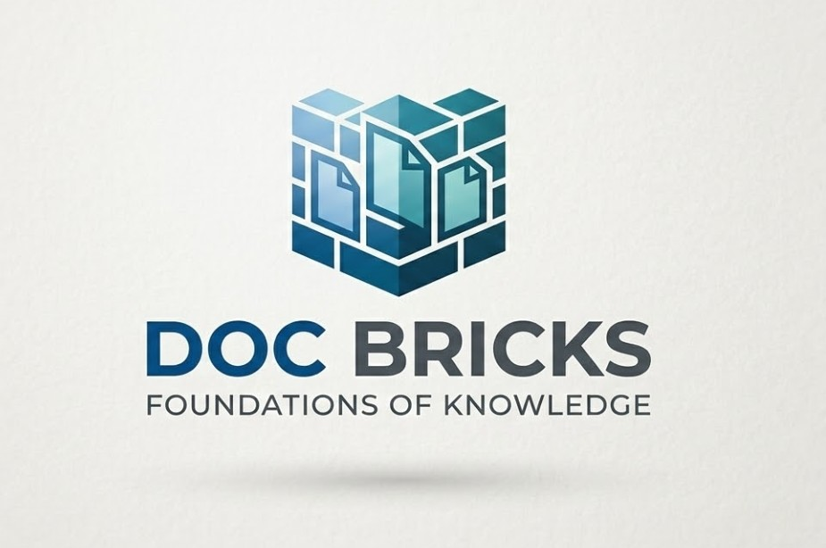
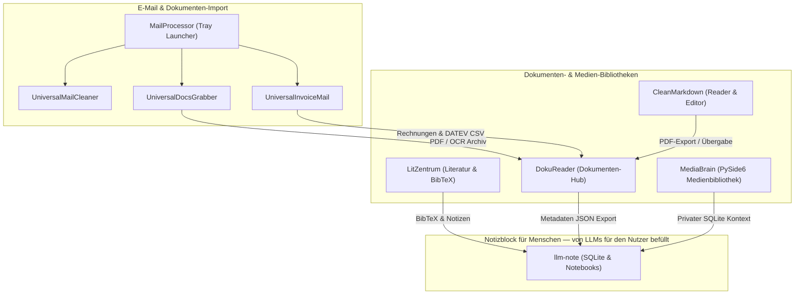

# doc-bricks

  

  <strong>Lokale Desktop-Tools für Dokumentbibliotheken, Lesen, E-Mail-Import, OCR, Literaturverwaltung und KI-Agenten-Notizen</strong>

  
  
  
  
  
  
  
  

> [!NOTE]
> **Local-First & KI-Bereit:** Alle doc-bricks Werkzeuge laufen lokal auf Ihrem System und halten Dokumente, PDFs und Notizen privat. Maschinenlesbarer Kontext ist in [`llms.txt`](https://github.com/doc-bricks/.github/blob/main/llms.txt) für KI-Agenten und Crawler verfügbar.

> [!TIP]
> **English Version:** An English version of this organization landing page is available at [`profile/README.md`](https://github.com/doc-bricks/.github/blob/main/profile/README.md).

---

## Ökosystem-Architektur

---

## Schnelleinstieg

| Ziel | Empfohlenes Tool | Hauptfunktion |
|---|---|---|
| Lokale Dokumentbibliotheken, Themen und PDF-Pakete verwalten | [DokuReader](https://github.com/doc-bricks/DokuReader) | Lokale Dokumentenverwaltung, Vorschau-Workflow, Lesestatus, PDF-Bundling und Metadaten-JSON-Export |
| Markdown ohne Cloud-Zwang lesen und editieren | [CleanMarkdown](https://github.com/doc-bricks/CleanMarkdown) | Lokaler Markdown-Viewer/Editor mit sauberem Lesemodus, PDF-Export, Sitzungsübergabe und PWA-Companion |
| Lokale Medien- und Dokumentkontexte organisieren | [MediaBrain](https://github.com/doc-bricks/MediaBrain) | PySide6 Medienbibliothek mit smarten Wiedergabelisten, Anbieter-Erkennung, Tags, Blacklist und privater SQLite-Datenbank |
| Literatur, PDFs, BibTeX und Forschungsnotizen verwalten | [LitZentrum](https://github.com/doc-bricks/LitZentrum) | Literaturverwaltung für akademisches Lesen, Bibliographie-Workflows und PDF-zentrierte Forschung |
| E-Mail-Tools aus einer System-Tray-App starten | [MailProcessor](https://github.com/doc-bricks/MailProcessor) | System-Tray-Einstiegspunkt für Universal Mail Cleaner, UniversalDocsGrabber und UniversalInvoiceMail |
| E-Mail-Anhänge automatisch lokal herunterladen & archivieren | [UniversalDocsGrabber](https://github.com/doc-bricks/UniversalDocsGrabber) | IMAP/Gmail Anhang-Downloader mit OCR, PDF-Konvertierung, Duplikaterkennung und Prüf-Workflows |
| Große IMAP- oder Gmail-Postfächer sicher bereinigen | [UniversalMailCleaner](https://github.com/doc-bricks/UniversalMailCleaner) | Postfach-Cleaner mit sicherem Papierkorb-Modus, Labels, Zeitplaner und Großdatei-Bereinigung |
| Rechnungen und Belege aus E-Mails erfassen | [UniversalInvoiceMail](https://github.com/doc-bricks/UniversalInvoiceMail) | Rechnungs-Extraktor mit Gmail/IMAP-Eingang, OCR, PDF-Konvertierung, JSON-Export und DATEV-Workflows |
| Lokale Notizen für KI-Agenten führen | [llm-note](https://github.com/doc-bricks/llm-note) | Lokale SQLite-Notizen, Plain-Text Notebooks, sechs Sprachen und eigenständiger Agent-Skill aus BACH |

---

## Verzeichnis der öffentlichen Repositories

Dieses Verzeichnis umfasst jedes öffentliche doc-bricks Repository, das per **2026-08-01** auf GitHub sichtbar ist. Private oder interne Repositories sind auf dem öffentlichen Organisationsprofil bewusst nicht aufgeführt.

| Repository | Rolle | Entdeckungs-Hinweise |
|---|---|---|
| [.github](https://github.com/doc-bricks/.github) | Organisationsprofil und Community-Dateien | Startseite, Issue-Templates, PR-Template, Sicherheitsrichtlinie und `llms.txt` |
| [CleanMarkdown](https://github.com/doc-bricks/CleanMarkdown) | Markdown lesen & editieren | Markdown-Viewer/Editor, Lesemodus, PDF-Export, Sitzungsübergabe, PWA-Companion |
| [DokuReader](https://github.com/doc-bricks/DokuReader) | Dokumentenbibliothek | Lokale Dokumentenverwaltung, Lesestatus, Themenorganisation, Vorschau, PDF-Bundling, JSON-Export |
| [LitZentrum](https://github.com/doc-bricks/LitZentrum) | Literaturverwaltung | PDF-Bibliothek, BibTeX-Workflows, akademisches Lesen, Forschungsnotizen, JSON-Export |
| [llm-note](https://github.com/doc-bricks/llm-note) | Agenten-Notizen | Lokales SQLite-Notizbuch, Plain-Text Notebooks, 6 Sprachen, CLI/Python-API und Agent-Skill |
| [MailProcessor](https://github.com/doc-bricks/MailProcessor) | E-Mail-Tool-Launcher | System-Tray-Einstiegspunkt für Universal Mail Cleaner, UniversalDocsGrabber und UniversalInvoiceMail |
| [MediaBrain](https://github.com/doc-bricks/MediaBrain) | Medien- & Dokumenten-Hub | PySide6 Medienbibliothek, smarte Wiedergabelisten, Provider-Erkennung, Tags, Blacklist, SQLite |
| [UniversalDocsGrabber](https://github.com/doc-bricks/UniversalDocsGrabber) | E-Mail-Anhang-Import | IMAP/Gmail Anhang-Downloader, OCR, PDF-Konvertierung, Duplikaterkennung, PWA-Review |
| [UniversalInvoiceMail](https://github.com/doc-bricks/UniversalInvoiceMail) | Rechnungs- & Beleg-Import | Rechnungs- und Beleg-Archivierung, OCR, PDF-Konvertierung, JSON-Export, DATEV-CSV-Export |
| [UniversalMailCleaner](https://github.com/doc-bricks/UniversalMailCleaner) | Postfach-Bereinigung | Gmail- & IMAP-Cleaner, sicherer Papierkorb-Modus, Labels, Zeitplaner, Großdatei-Bereinigung |

---

## Projektfamilien

### Dokumenten-Leser & Bibliotheken

| App | Beschreibung |
|---|---|
| [DokuReader](https://github.com/doc-bricks/DokuReader) | Lokale Dokumentenbibliothek mit Themenorganisation, Vorschauen, Lesestatus, PDF-Paketen und Metadaten-Export |
| [CleanMarkdown](https://github.com/doc-bricks/CleanMarkdown) | Markdown-Viewer/Editor für sauberes Lesen, Bearbeiten, PDF-Export und Sitzungsübergabe |
| [LitZentrum](https://github.com/doc-bricks/LitZentrum) | Literaturverwaltung mit PDF, BibTeX, JSON-Export und forschungs-orientierter Organisation |
| [MediaBrain](https://github.com/doc-bricks/MediaBrain) | PySide6 Medienbibliothek mit smarten Wiedergabelisten, Anbieter-Erkennung, Tags, Blacklist und privater SQLite-Datenbank |

### E-Mail- & Import-Workflows

| App | Beschreibung |
|---|---|
| [MailProcessor](https://github.com/doc-bricks/MailProcessor) | System-Tray-Starter für Universal Mail Cleaner, UniversalDocsGrabber und UniversalInvoiceMail |
| [UniversalMailCleaner](https://github.com/doc-bricks/UniversalMailCleaner) | Lokale Gmail- und IMAP-Postfachbereinigung mit Sichermodi und Zeitplaner |
| [UniversalDocsGrabber](https://github.com/doc-bricks/UniversalDocsGrabber) | Anhang-Downloader und Dokumentenarchiv-Builder für IMAP/Gmail-Import, OCR, PDF-Konvertierung und PWA-Review |
| [UniversalInvoiceMail](https://github.com/doc-bricks/UniversalInvoiceMail) | Erfassungspipeline für Rechnungen und Belege für lokale Archive, OCR/PDF-Konvertierung, JSON-Export und DATEV-CSV-Export |

### PDF, OCR & Export

| App | Beschreibung |
|---|---|
| [UniversalDocsGrabber](https://github.com/doc-bricks/UniversalDocsGrabber) | Konvertiert heruntergeladene E-Mail-Dokumente in prüfbares PDF/OCR-Archivmaterial |
| [UniversalInvoiceMail](https://github.com/doc-bricks/UniversalInvoiceMail) | Konvertiert Rechnungs- und Beleg-Mails in PDF/OCR-Archivmaterial und buchhaltungsnahe Exports |
| [CleanMarkdown](https://github.com/doc-bricks/CleanMarkdown) | Exportiert Markdown-Lese-Sitzungen in PDF und begleitende Webformate |

### Notizen & Agenten-Übergaben

| App | Beschreibung |
|---|---|
| [llm-note](https://github.com/doc-bricks/llm-note) | Lokale Notizen und Notebook-Inboxen für KI-Agenten, hervorgegangen aus BACH Notizblock/Denkarium-Mustern |

---

## Design-Prinzipien

- **Local-First:** Dokumente, E-Mail-Exporte, Indizes und Lesestatus bleiben standardmäßig auf dem Rechner des Nutzers.
- **Datenschutzorientiert:** Werkzeuge meiden Cloud-Verarbeitung, sofern nicht explizit externe Dienste wie Gmail konfiguriert werden.
- **Praxisnah:** Jedes Projekt zielt auf wiederkehrende reale Workflows: Lesen, Vorschau, Bereinigen, Exportieren, Archivieren und Übergabe.
- **Strukturierte Exporte:** JSON, BibTeX, PDF und Begleitformate sind dokumentiert für einfachen Datenaustausch zwischen Desktop-Tools und Automationen.
- **Wartbare Dokumentation:** READMEs, Tests und `llms.txt`-Dateien bieten Nutzen für menschliche Entwickler wie für KI-Assistenten.

---

## Entdeckungs-Signale

Nützliche Suchbegriffe für das öffentliche doc-bricks Profil umfassen `lokale Dokumenten-Tools`, `Python Dokumentenverwaltung`, `PySide6 PDF OCR`, `DokuReader Metadaten JSON Export`, `MediaBrain Wiedergabelisten SQLite`, `Gmail IMAP Anhang Downloader`, `Markdown PDF Export`, `Literaturverwaltung GitHub`, `Rechnungsmail OCR DATEV Export` und `lokale KI Agenten Notizen`.

---

## Maschinenlesbarer Kontext

Für Crawler und KI-Tools siehe [`llms.txt`](https://github.com/doc-bricks/.github/blob/main/llms.txt). Es führt die kanonischen Repositories, Projektrollen und bevorzugten Suchbegriffe der doc-bricks Organisation auf.

---

## Ökosystem

doc-bricks ist der Dokumenten-Zweig der Brick-Suite:

[open-bricks](https://github.com/open-bricks) | [file-bricks](https://github.com/file-bricks) | [dev-bricks](https://github.com/dev-bricks)

Teil des [ellmos-ai](https://github.com/ellmos-ai) Ökosystems: [llm-note](https://github.com/doc-bricks/llm-note) wurde aus [ellmos-ai/bach](https://github.com/ellmos-ai/bach)s Notizblock/Denkarium-Mustern ausgekoppelt und bleibt als eigenständiger Agenten-Skill nutzbar.

---

## Verwandte Projekte (andere Orgs)

| Projekt | Beschreibung |
|---|---|
| [WikiStub-Seed](https://github.com/dev-bricks/WikiStub-Seed) | Mehrsprachiges Wissens-Stub-Dataset (630 Begriffe, 12 Domänen, DE/EN + es/ja/ru/zh) mit Web-Publisher — als eigenständiges Wiki-Modul einsetzbar |
